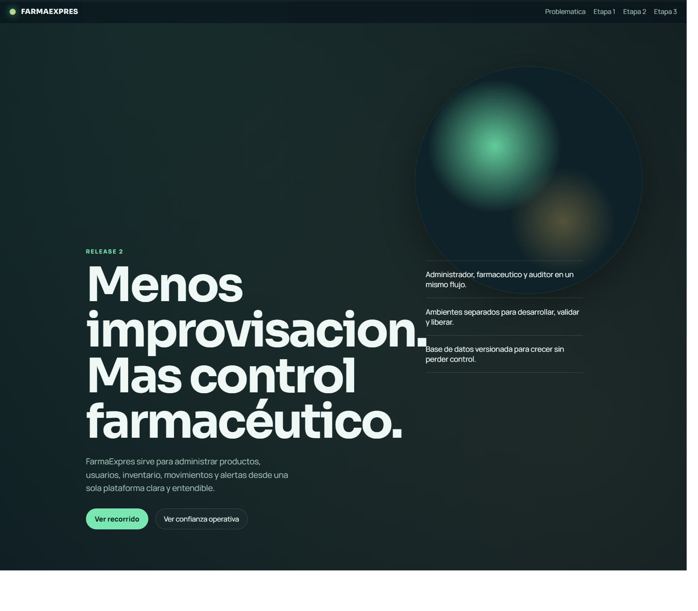
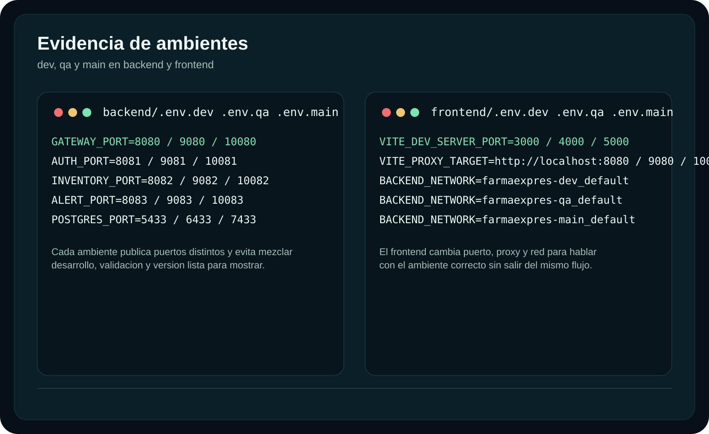
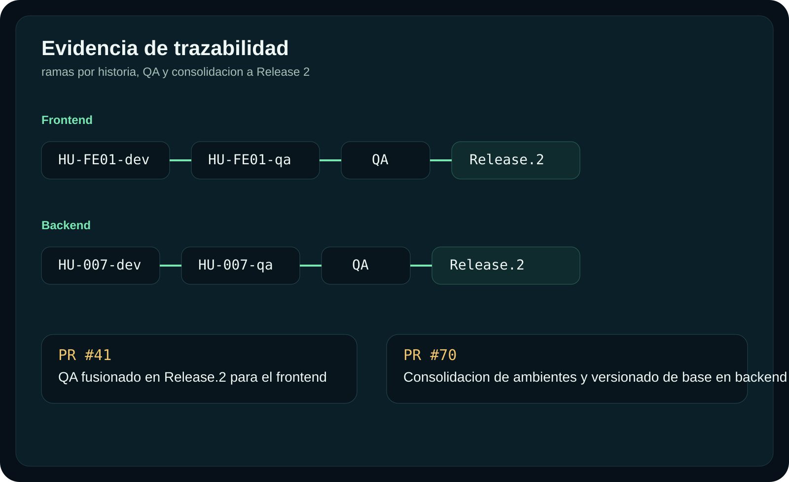
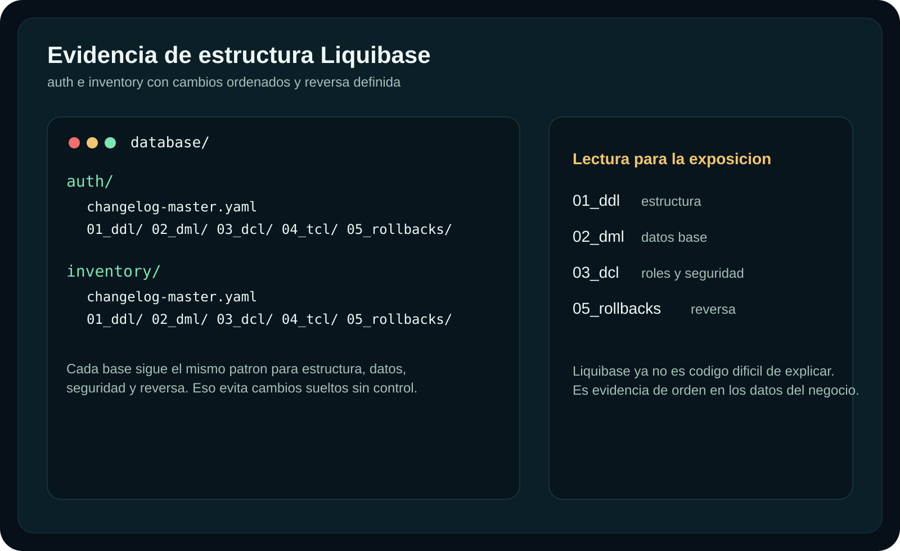
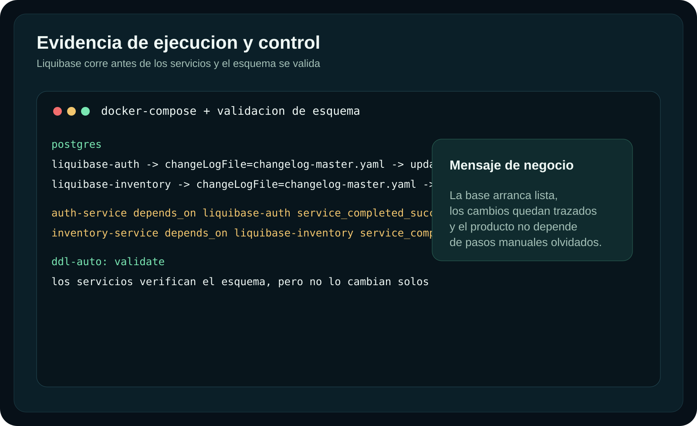

# Week-11

## Release 2 Delivery

Week 11 is focused on the **Release 2 delivery** of FarmaExpres.

This repository packages the public-facing presentation of the release in a local HTML experience with:

- a clear product narrative starting from the pharmacy problem
- a role-based walkthrough for **Administrator**, **Pharmacist**, and **Auditor**
- embedded video evidence for the main product flows
- release evidence for **dev**, **qa**, and **main**
- a simple explanation of **Liquibase** in business language

The goal of this week is not to introduce a brand-new standalone feature inside this repository, but to **consolidate, present, and document Release 2** in a way that is understandable for stakeholders and ready for live demonstration.

---

## Table of Contents

- [What Changed Since Week 10](#what-changed-since-week-10)
- [What This Repository Includes](#what-this-repository-includes)
- [Presentation Structure](#presentation-structure)
- [Evidence](#evidence)
- [How To Run Locally](#how-to-run-locally)
- [Release 2 Notes](#release-2-notes)

---

## What Changed Since Week 10

During **Week 10**, the team concentrated on closing and consolidating the implementation work across backend and frontend:

- Backend closure from **HU-011** to **HU-016**
- Backend adjustments around **HU-AC02**
- Frontend QA documentation from **HU-QA-FE-08** to **HU-QA-FE-12**
- Base preparation for **HU-017**, related to database versioning

For **Week 11**, the focus moved from implementation closure to **Release 2 packaging and delivery**:

- The release is now presented through a dedicated local HTML experience.
- The walkthrough is organized around real product flows, not code snippets.
- The release explains how the product behaves across roles and operational scenarios.
- The evidence now includes environment diversification across **dev**, **qa**, and **main**.
- The delivery highlights the database versioning strategy with **Liquibase** as a reliability and consistency enabler.
- The repository also includes visual release evidence tied to the promotion path toward **Release.2**.

### Week 11 summary

- This week is primarily a **release delivery and evidence consolidation** week.
- The strongest visible technical addition tied to Release 2 is the explanation and evidence for:
  - environment separation
  - release traceability
  - Liquibase-based database versioning
- If the question is whether this repository adds a new isolated user story by itself, the answer is **no**.
- If the question is whether Release 2 includes new consolidated value compared to Week 10, the answer is **yes**:
  - better release readiness
  - clearer stakeholder communication
  - stronger evidence around deployment discipline and data stability

---

## What This Repository Includes

### Main presentation files

- `release2-presentation.html`
- `release2-presentation.css`
- `release2-presentation.js`

### Demo media

- `1/1.mp4` to `1/15.mp4`

These videos support the product walkthrough for:

- Administrator product management
- Administrator user control
- Reports, filters, and alerts
- Pharmacist inventory operations
- Auditor review and verification flows

### Supporting assets

- `assets/evidence-ambientes.svg`
- `assets/evidence-release.svg`
- `assets/evidence-liquibase-structure.svg`
- `assets/evidence-liquibase-flow.svg`
- `assets/screenshots/overview.png`

### Local helper

- `presentacion-local.cmd`

This helper starts a local server and opens the presentation in the browser to avoid local media playback issues.

---

## Presentation Structure

The HTML presentation is organized in four major moments:

### 1. Problem statement

The presentation starts by explaining the real operational problem of a small pharmacy:

- unclear inventory visibility
- risk of expired products
- low traceability of movements
- weak reporting for decision-making

### 2. Product walkthrough

The product section shows how FarmaExpres organizes the operation by role:

- **Administrator**
  - create product
  - update product
  - delete product
  - create user
  - block user
  - update user and password
  - review movements
  - view reports and Excel
  - check alerts
- **Pharmacist**
  - review inventory
  - register entry
  - register output
- **Auditor**
  - review inventory
  - inspect filtered movements
  - review reports

### 3. Environment diversification

Release 2 shows that the product is not only functional, but also organized for growth:

- `dev` for active development
- `qa` for validation
- `main` for stable release delivery

This section connects the release to real operational discipline rather than only interface behavior.

### 4. Liquibase explanation

Liquibase is presented as a product trust component:

- database changes are versioned
- environments stay aligned
- services validate the schema before working
- the product grows without losing control of its data

---

## Evidence

### HTML presentation overview



### Environment evidence



### Release traceability evidence



### Liquibase structure evidence



### Liquibase execution evidence



---

## How To Run Locally

### Option 1: clone and open directly

```bash
git clone https://github.com/Marlon271/Week-11.git
cd Week-11
```

Then open:

- `release2-presentation.html`

This works in many local setups and is the fastest way to inspect the delivery.

### Option 2: recommended for live demo

If your browser blocks local MP4 playback or you want a more stable live presentation flow, run:

- `presentacion-local.cmd`

This will:

- start a local HTTP server
- open the presentation automatically in the browser

---

## Release 2 Notes

This repository is meant to support the **public presentation of Release 2**.

It is intentionally prepared for stakeholder visibility:

- no external navigation is required during the explanation
- the content is written in clear language
- the structure prioritizes product understanding over code discussion
- the evidence keeps the focus on product value, operational order, and release confidence

From a release perspective, Week 11 demonstrates that FarmaExpres is not only showing screens, but also:

- a coherent product story
- disciplined environment management
- traceable release promotion
- controlled database evolution

That is what makes Release 2 presentable as a product rather than only as a development exercise.
